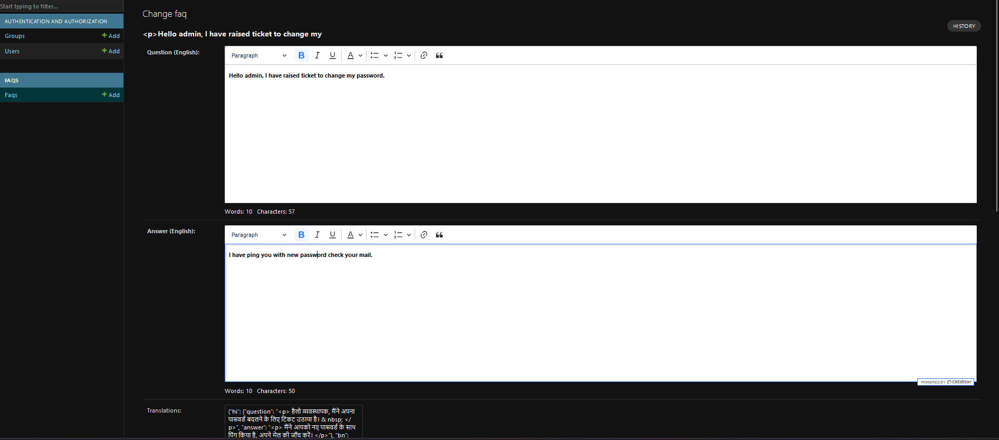
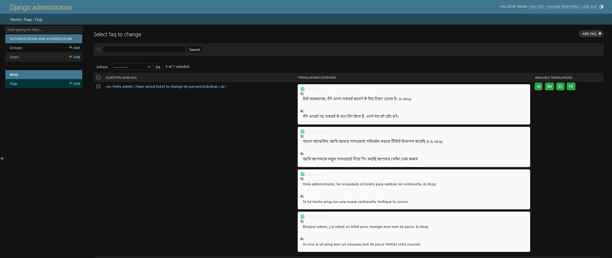

# FAQ Management System - Backend

## Overview

This backend application allows users to manage frequently asked questions (FAQs) with multilingual support and rich text editing. Built with Django, it includes REST APIs, caching via Redis, and automated translations. Designed for scalability and performance, it demonstrates modern backend development practices.

### Technical Stack

- **Django** (Python) - Core backend framework
- **Django REST Framework** - API construction
- **SQLite** - Server-less Relational database
- **Redis** - Caching for improved performance
- **django-ckeditor** - Rich text editing in admin panel
- **googletrans** - Free translation library (no API key required)
- **Docker** - Containerization 

### Key Features

1. **Multilingual Support**
   - FAQs stored with base language (English)
   - Auto-translation to 100+ languages via `googletrans`
   - Manual translation override capability

2. **Efficient Caching**
   - Redis integration for FAQ response caching
   - Cache invalidation on FAQ updates

3. **Admin-Friendly Interface**
   - WYSIWYG editor for FAQ answers
   - Language management dashboard
   - Direct database operations via Django Admin

4. **REST API Endpoints**
   - Language parameter support (`?lang=hi`)
   - Pagination and search-ready architecture
   - JSON responses with HTTP status codes

## Setup Instructions

### 1. Clone Project

git clone https://github.com/yourusername/faq-management-system.git
cd faq-management-system

### 2. Configure Environment

Create .env/.cfg from template:

Edit with your settings:

# .env
REDIS_URL=redis://localhost:6379/0

### 3. Install Dependencies

python -m venv projenv
projenv\Scripts\activate
pip install -r requirements.txt

### 4. Database Setup

python manage.py migrate
python manage.py createsuperuser

### 5. Run Services

Start Redis (separate terminal):

redis-server

Start Django server:

python manage.py runserver

### 6. API Documentation
Get FAQs

API Endpoints

    GET /api/faqs/ - Get all FAQs (English)

    GET /api/faqs/?lang=hi - Get FAQs in Hindi

    GET /api/faqs/?lang=bn - Get FAQs in Bengali

    GET /api/faqs/?lang=fr - Get FAQs in French

    GET /api/faqs/?lang=es - Get FAQs in Spanish

Parameters:

    lang (optional): 2-letter language code (default: en)

Example Request:

curl "http://localhost:8000/api/faqs/?lang=es"

Response:

{
  "count": 3,
  "next": null,
  "previous": null,
  "results": [
    {
      "question": "¿Qué es la IA?",
      "answer": "
IA significa <strong>Inteligencia Artificial</strong>
",
      "language": "es"
    }
  ]
}

### 7. Testing

Run all tests:

pytest tests/ --verbosity=2

Test coverage:

coverage run -m pytest tests/
coverage report

### 8.Deployment with Docker

    Build and start containers:

docker-compose up --build

    Apply migrations:

docker-compose exec web python manage.py migrate

    Create admin user:
        username:
        email:
        password:

docker-compose exec web python manage.py createsuperuser

Access at http://localhost:8000/admin

